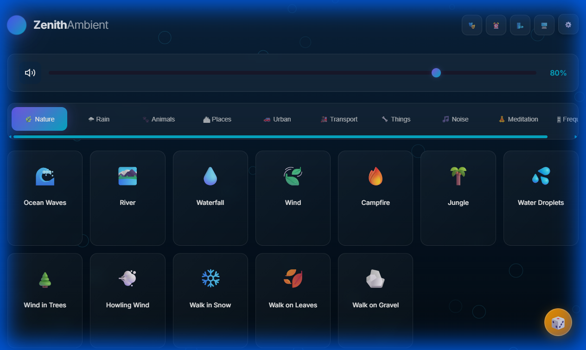
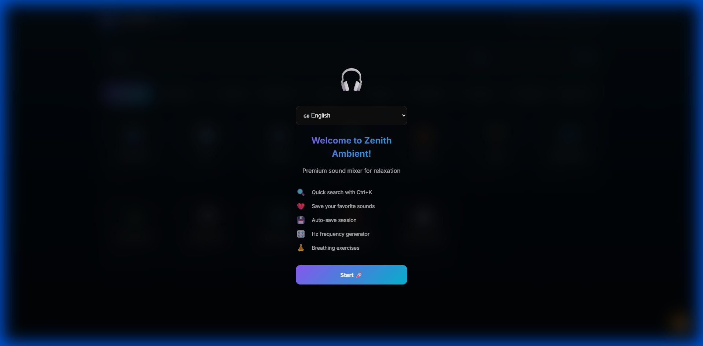
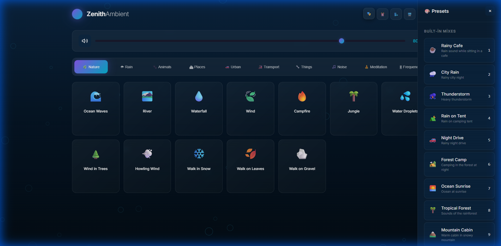
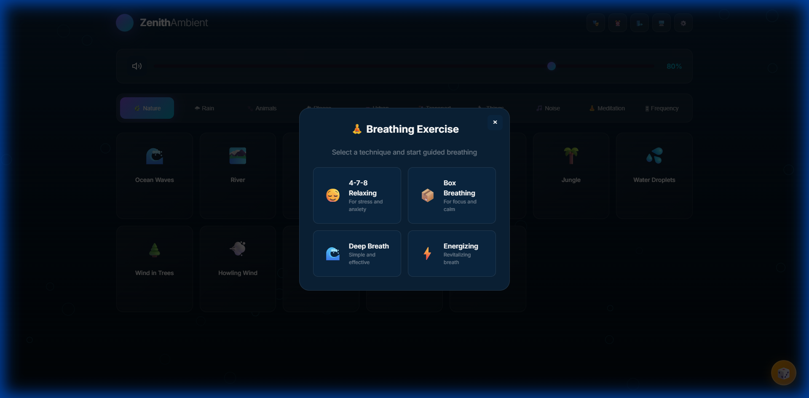
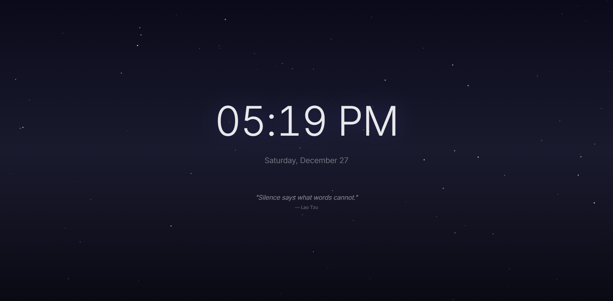
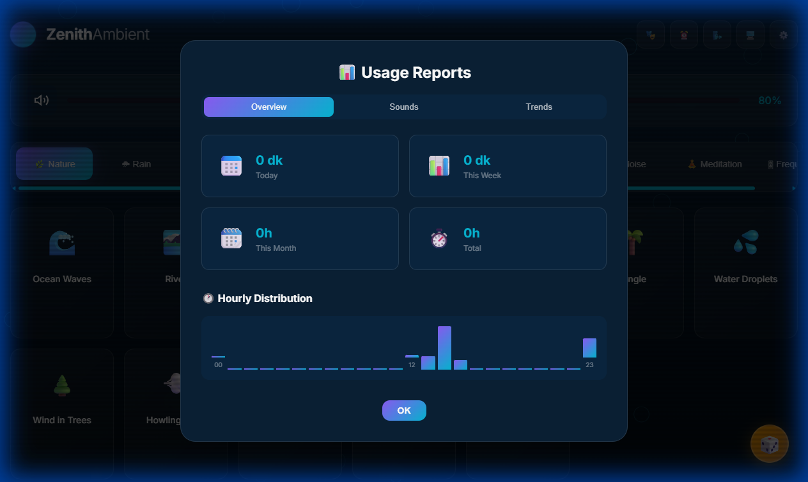
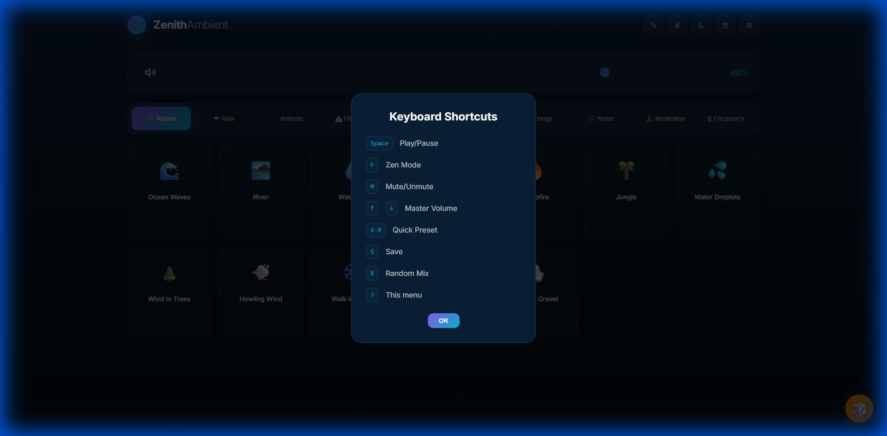

<div align="center">

# 🎵 Zenith Ambient

### Premium Ambient Sound Mixer for Focus, Relaxation & Sleep

[](LICENSE)
[](#installation)
[](#sound-library)
[](#themes)
[](#internationalization)

*Create your perfect soundscape by mixing high-quality ambient sounds*

[Live Demo](https://your-demo-url.com) · [Report Bug](../../issues) · [Request Feature](../../issues)

</div>

---

## 📸 Screenshots

<div align="center">

### Main Interface

*Beautiful, modern interface with categorized sound cards*

</div>

<div align="center">

### Welcome Screen

*Onboarding experience with language selection*

</div>

---

## ✨ Features

### 🎧 100+ High-Quality Ambient Sounds
Curated collection of premium ambient sounds across 10 categories:

| Category | Sounds | Examples |
|----------|--------|----------|
| 🌿 **Nature** | 15+ | Ocean waves, River, Waterfall, Wind, Campfire, Jungle |
| 🌧️ **Rain** | 10+ | Gentle rain, Heavy rain, Thunder, Rain on window, Rain on tent |
| 🐾 **Animals** | 15+ | Birds, Crickets, Frogs, Owl, Whale, Wolf |
| 🏙️ **Places** | 12+ | Café, Library, Office, Restaurant, Temple |
| 🚗 **Urban** | 8+ | City traffic, Construction, Crowd, Keyboard typing |
| 🚂 **Transport** | 6+ | Airplane cabin, Train, Car, Subway |
| 🔧 **Things** | 12+ | Clock, Fan, Fireplace, Washing machine, Vinyl crackle |
| 📻 **Noise** | 5+ | White noise, Pink noise, Brown noise |
| 🧘 **Meditation** | 5+ | Tibetan bowls, OM chanting, Binaural beats |
| 🎵 **Frequency** | 10+ | Solfeggio frequencies (174Hz - 963Hz) |

---

### 🎨 18 Beautiful Themes

Transform your experience with carefully designed color themes:

| Standard | Nature | Atmospheric | Special |
|----------|--------|-------------|---------|
| 🌙 Dark | ❄️ Snow | 🌅 Sunset | 💜 Neon |
| 🌃 Night | 🌧️ Rain | 🌌 Aurora | 🏜️ Desert |
| ☀️ Light | 🔥 Fire | 🌸 Sakura | ⛈️ Storm |
| | 🌲 Forest | 🌌 Galaxy | 🧘 Zen |
| | 🌊 Ocean | 🍂 Autumn | 📺 Retro |

Each theme includes:
- Custom color palette
- Background gradients
- Ambient particle effects
- Dynamic animations

---

### 🎭 Curated Presets

<div align="center">


*Quickly switch ambiances with built-in presets*

</div>

Jump right into the perfect ambiance with pre-configured sound mixes:

- 🌧️ **Rainy Café** - Perfect for working or reading
- 🔥 **Cozy Fireplace** - Warm and relaxing atmosphere
- 🌲 **Forest Morning** - Fresh and peaceful
- 🌊 **Beach Sunset** - Ocean waves and seagulls
- 🧘 **Deep Meditation** - Tibetan bowls and nature
- 📚 **Study Session** - Library ambiance with light rain
- 🌙 **Sleep Helper** - Gentle sounds for better sleep
- ✈️ **Long Flight** - Airplane cabin white noise
- And many more...

---

### ⏰ Sleep Timer

**Features:**
- Duration options: 15min, 30min, 45min, 1h, 1.5h, 2h
- Optional smooth fade-out effect
- Visual countdown indicator
- Automatic stop when timer ends

---

### 🫁 Breathing Exercises

<div align="center">


*Guided breathing exercise with visual animation*

</div>

Built-in breathing techniques for relaxation:

| Technique | Pattern | Best For |
|-----------|---------|----------|
| **Box Breathing** | 4-4-4-4 | Stress relief, focus |
| **4-7-8 Relaxing** | 4-7-8 | Sleep, anxiety |
| **Energizing** | 6-0-2 | Morning wake-up |
| **Calm Breath** | 4-7-8 | Deep relaxation |

Features:
- Visual breathing circle animation
- Configurable duration
- Sound synchronization
- Session counter

---

### 🧘 Zen Mode (Fullscreen)

<div align="center">


*Distraction-free fullscreen experience*

</div>

Immerse yourself completely:
- Fullscreen mode with minimal UI
- Beautiful clock display
- Inspirational quotes
- Particle effects background
- Click anywhere to exit

---

### 🏆 Achievements System

Unlock achievements as you use the app:

| Achievement | Requirement |
|-------------|-------------|
| 🎵 First Sound | Play your first sound |
| 🎨 Theme Explorer | Try 5 different themes |
| 🎧 Mix Master | Create a mix with 5+ sounds |
| ⏰ Night Owl | Use for 10+ hours total |
| 🧘 Zen Master | Complete 10 breathing sessions |
| 🏆 Collector | Unlock 50% of sounds |

---

### 📊 Usage Analytics

<div align="center">


*Track your listening habits*

</div>

Personal statistics dashboard:
- Daily, weekly, monthly listening time
- Hourly usage patterns
- Most played sounds
- Streak tracking
- Session history

---

### ⚙️ Customization Options

<div align="center">


*Extensive settings panel*

</div>

Fine-tune your experience:

| Setting | Description |
|---------|-------------|
| **Sound Behavior** | Meander mode - sounds with natural volume variation |
| **Cross-fade** | Smooth transitions when switching sounds |
| **Auto Theme** | Day/Night automatic theme switching |
| **Master Volume** | Global volume control |
| **Language** | 9 language options |

---

## 🌍 Internationalization

Full multi-language support:

| Language | Code | Status |
|----------|------|--------|
| 🇬🇧 English | `en` | ✅ Complete |
| 🇹🇷 Türkçe | `tr` | ✅ Complete |
| 🇩🇪 Deutsch | `de` | ✅ Complete |
| 🇫🇷 Français | `fr` | ✅ Complete |
| 🇪🇸 Español | `es` | ✅ Complete |
| 🇮🇹 Italiano | `it` | ✅ Complete |
| 🇵🇹 Português | `pt` | ✅ Complete |
| 🇯🇵 日本語 | `ja` | ✅ Complete |
| 🇸🇦 العربية | `ar` | ✅ Complete (RTL) |

---

## ⌨️ Keyboard Shortcuts

<div align="center">


*Comprehensive keyboard control*

</div>

| Key | Action |
|-----|--------|
| `Space` | Play/Pause all sounds |
| `M` | Mute/Unmute |
| `↑` / `↓` | Volume up/down |
| `R` | Random mix |
| `F` | Fullscreen (Zen Mode) |
| `Esc` | Close panels/Exit Zen |
| `1-9` | Quick preset selection |
| `?` | Show shortcuts help |

---

## 🚀 Installation

### Option 1: Direct Use
Simply open `index.html` in any modern browser!

### Option 2: Install as PWA (Progressive Web App)

1. Open the app in Chrome/Edge
2. Click the install icon in address bar
3. Click "Install"
4. Use as a standalone desktop app!

### Option 3: Self-Host

```bash
# Clone the repository
git clone https://github.com/yourusername/zenith-ambient.git

# Navigate to directory
cd zenith-ambient

# Serve with any static server
npx serve .
# or
python -m http.server 8080
```

---

## 📁 Project Structure

```
zenith-ambient/
├── index.html              # Main HTML file
├── manifest.json           # PWA manifest
├── sw.js                   # Service Worker for offline use
│
├── css/
│   ├── main.css            # Core styles
│   ├── themes.css          # Theme definitions
│   ├── features.css        # Feature-specific styles
│   ├── animations.css      # CSS animations
│   ├── breathing.css       # Breathing exercise styles
│   ├── achievements.css    # Achievement modal styles
│   ├── analytics.css       # Analytics panel styles
│   └── i18n.css           # RTL & language styles
│
├── js/
│   ├── app.js              # Main application logic
│   ├── sounds.js           # Sound definitions & manager
│   ├── presets.js          # Preset configurations
│   ├── timer.js            # Sleep timer logic
│   ├── breathing.js        # Breathing exercises
│   ├── achievements.js     # Achievement system
│   ├── analytics.js        # Usage tracking
│   ├── favorites.js        # Favorites management
│   ├── storage.js          # LocalStorage utilities
│   ├── particles.js        # Background particles
│   ├── frequency.js        # Solfeggio frequencies
│   ├── keyboard.js         # Keyboard shortcuts
│   └── i18n.js             # Internationalization
│
├── sounds/                 # Audio files (100+)
│
├── icons/                  # PWA icons
│
└── screenshots/           # README screenshots
```

---

## 🛠️ Technical Details

### Technologies Used
- **HTML5** - Semantic markup
- **CSS3** - Modern styling with CSS Variables, Flexbox, Grid
- **Vanilla JavaScript** - No frameworks, pure performance
- **Web Audio API** - Sound mixing and effects
- **Service Worker** - Offline capability
- **LocalStorage** - Persistent settings

### Browser Support
- ✅ Chrome 80+
- ✅ Firefox 75+
- ✅ Safari 14+
- ✅ Edge 80+
- ✅ Opera 67+

### Performance
- ⚡ < 100KB JavaScript (minified)
- ⚡ Lazy loading for audio files
- ⚡ Optimized animations (GPU accelerated)
- ⚡ Service Worker caching

---

## 🔒 Privacy

**100% Privacy-Focused:**
- ✅ No tracking or analytics sent to servers
- ✅ No account required
- ✅ All data stored locally
- ✅ Works completely offline
- ✅ No external API calls

---

## 🤝 Contributing

Contributions are welcome! Here's how you can help:

1. **Fork** the repository
2. **Create** a feature branch (`git checkout -b feature/AmazingFeature`)
3. **Commit** your changes (`git commit -m 'Add AmazingFeature'`)
4. **Push** to the branch (`git push origin feature/AmazingFeature`)
5. **Open** a Pull Request

### Ideas for Contributions
- [ ] Add more ambient sounds
- [ ] Create new themes
- [ ] Add translations for more languages
- [ ] Improve accessibility (screen reader support)
- [ ] Add sound equalizer
- [ ] Implement Pomodoro timer mode

---

## 📄 License

This project is licensed under the MIT License - see the [LICENSE](LICENSE) file for details.

---

## 🙏 Credits

**Sound Sources:**
- [A Soft Murmur](https://asoftmurmur.com/) - Nature & ambient sounds
- [Moodist](https://moodist.app/) - Additional sound library

**Inspiration:**
- Noisli, Calm, Headspace

---

<div align="center">

### Made with ❤️ for better focus & relaxation

⭐ **Star this repo if you find it useful!** ⭐

[Back to Top](#-zenith-ambient)

</div>
